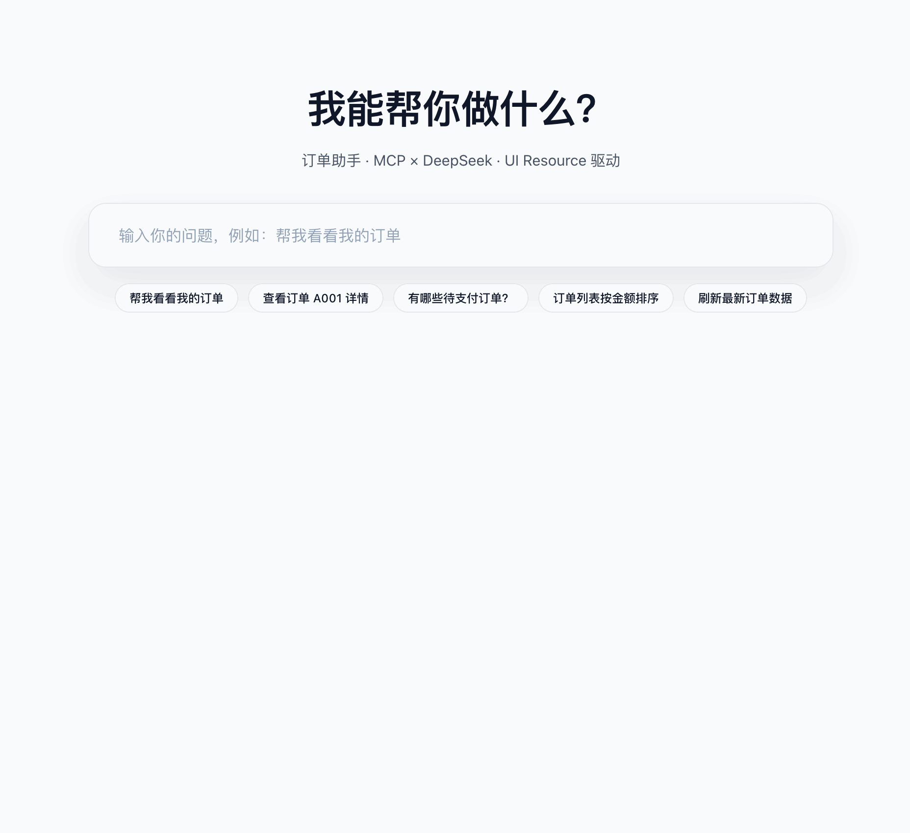

# MCP Use × DeepSeek Demo

MCP Use + DeepSeek 的完整链路 Demo，包含 MCP Server/UI resources、MCP Client/Agent、API 层与 Nuxt Web 前端。



## 目录
- `mcp-server/`：订单 Mock 数据与 MCP 工具（get_orders / get_order_detail）。
- `agent/`：使用 mcp-use + DeepSeek 的 Agent，自动调用 MCP 工具并返回结构化UI Resource / UI Blocks。
- `web/`：Nuxt 4 + Nuxt UI 的 Chat UI，负责渲染 UI Resource / UI Block。
- `web/server/`：API 层，负责处理 MCP Client/Agent 的请求。
- `shared/`：共享类型定义。

## 环境
- Node.js ≥ 18
- 包管理：pnpm
- DeepSeek Key：`DEEPSEEK_API_KEY`（Agent 运行必需）

## 快速开始
```bash
pnpm install

# 测试 MCP Client 调用
pnpm --filter @demo/agent test:client

# 启动前端（另开终端）
pnpm --filter @demo/web dev
```

## 渲染逻辑
- **Agent 输出**：系统提示强制 text / text_delta 以 Markdown 表达，禁止 HTML；UI Resource 仍通过结构化 `ui_resource` block 返回。
- **Markdown 渲染**：前端采用 [markstream-vue](https://github.com/Simon-He95/markstream-vue)，在 `MessageRenderer` 中对 streaming 文本块做增量渲染，确保打字体验丝滑。
- **UI Resource 渲染**：`UiResourceRenderer` 仍然按 `resourceId` 拉取 JSON Schema → Vue 组件映射，仅负责渲染（不推理业务），与 Markdown 互不影响。

